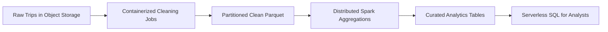
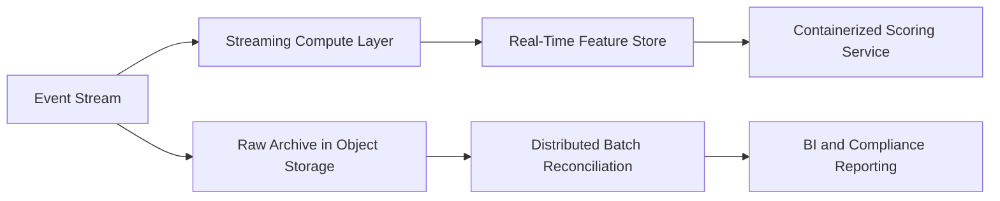

## Session Positioning

This lecture is about applying containerization and distributed computing to real analytics problems.

Primary focus:

* Problem framing
* Architecture choices
* Performance, cost, and reliability outcomes

Lab assets are used as one example, not as the lecture itself.

---

## Why This Matters for Data Analytics

Modern analytics teams must handle:

* Growing data volume and velocity
* Mixed workloads (ETL, BI, ML feature pipelines)
* Reproducibility and auditability requirements
* Pressure to deliver faster insights at lower cost

Containerization and distributed computing are not goals.

They are means to analytics outcomes.

---

## Learning Outcomes

By the end of class, students should be able to:

1. Diagnose where containerization improves analytics workflow quality.
2. Select distributed compute patterns based on workload characteristics.
3. Design analytics architectures that balance speed, cost, and governance.
4. Map AWS and Google Cloud services based on function, not vendor memorization.
5. Defend architecture choices in concrete business scenarios.

---

## 3-Hour Flow

| Time | Focus |
|---|---|
| 0:00-0:20 | Problem framing and workload taxonomy |
| 0:20-0:50 | Containerization applied to analytics systems |
| 0:50-1:05 | Distributed compute principles and limits |
| 1:05-1:15 | Break |
| 1:15-1:55 | Case Study A: Batch analytics platform |
| 1:55-2:25 | Case Study B: Near-real-time analytics |
| 2:25-2:45 | Cost, performance, reliability, and governance |
| 2:45-2:58 | Architecture design studio |
| 2:58-3:00 | Exit ticket |

---

## Workload Taxonomy for Analytics Engineering

| Workload Type | Typical SLA | Data Characteristics | Compute Pattern |
|---|---|---|---|
| Batch ETL | Hourly to daily | Large append-only files | Distributed batch |
| Interactive BI | Seconds | Curated aggregated tables | Serverless SQL |
| Streaming Metrics | Sub-minute | Event streams | Stateful stream processing |
| ML Feature Prep | Daily to weekly | Wide joins, feature windows | Distributed Spark/SQL |
| Model Scoring at Scale | Seconds to minutes | High request volume | Autoscaled containers |

---

## Where Containers Add Analytics Value

Containers improve:

* Reproducibility of data transformations
* Portability across developer, test, and cloud runtimes
* Dependency control for fragile Python/R package stacks
* Team-level standardization for job interfaces

They do not remove the need for:

* Data contracts
* Observability
* IAM and network controls

---

## Containerization as a Contract

A useful analytics container defines:

* Clear input contract (path, format, schema assumptions)
* Clear output contract (partitioning, format, naming)
* Deterministic behavior (same inputs -> same outputs)
* Runtime observability (structured logs and metrics)

```yaml
# Conceptual job contract
job:
  input: "s3://bucket/raw/date=YYYY-MM-DD/"
  output: "s3://bucket/clean/date=YYYY-MM-DD/"
  format: "parquet"
  retries: 2
```

---

## Anti-Patterns: Containers in Analytics

Avoid these failure modes:

* Packaging monolithic scripts with too many unrelated steps
* Hardcoding environment-specific paths and secrets
* Using mutable tags like `latest` for critical jobs
* Ignoring idempotency (reruns cause duplicate outputs)
* Treating container success as data quality success

---

## What Distributed Computing Actually Solves

Distributed systems help when analytics tasks involve:

* Large scans and joins
* High shuffle volume
* Time-constrained batch windows
* Parallel partition processing

Distributed systems add overhead when:

* Data is small
* Workloads are simple
* Team lacks operational maturity

---

## Decision Axes for Architecture

Evaluate each pipeline stage by:

1. Data scale and growth rate
2. Freshness requirement
3. Transformation complexity
4. Failure tolerance and restart strategy
5. Cost predictability requirements
6. Security and compliance constraints

---

## Case Study A: Batch Analytics for Urban Mobility

Business question:

* "How do trip demand and fare behavior vary by zone, hour, and day?"

Pipeline intent:

1. Clean noisy trip records consistently
2. Aggregate at scale for analyst-friendly consumption
3. Serve interactive queries for operations and planning teams

---

## Case Study A Architecture



Application takeaway:

* Split pipeline by responsibility to optimize each stage independently.

---

## Case Study A: Why This Split Works

Cleaning layer (containers):

* Consistent row-level quality filters
* Parallel partition processing with retries

Aggregation layer (distributed compute):

* Heavy group-by and percentile logic
* Efficient processing over multiple partitions

Serving layer (serverless SQL):

* Fast analyst access with no cluster management

---

## Case Study A: Outcome Metrics to Track

Technical metrics:

* Pipeline completion time
* Failed partition rerun rate
* Query bytes scanned and runtime

Analytics metrics:

* Freshness of daily KPI tables
* Coverage of valid records after cleaning
* Time-to-answer for analyst questions

---

## Case Study B: Near-Real-Time Fraud Monitoring

Business question:

* "Can we detect suspicious transactions within 2 minutes?"

Different design implications:

* Batch-only architecture is insufficient
* Need event ingestion + low-latency scoring path
* Still need batch backfill and retraining features

---

## Case Study B Reference Architecture



Application takeaway:

* Combine streaming and batch; do not force one model onto all workloads.

---

## Case Study C: MLOps Feature Engineering at Scale

Business question:

* "How do we generate stable, reusable features across teams weekly?"

Applied pattern:

* Containerized feature jobs with strict schema contracts
* Distributed joins and window aggregations in Spark
* Versioned feature outputs with lineage metadata

Risk if done poorly:

* Training-serving skew and irreproducible experiments

---

## Cross-Cloud Mapping by Intent (Not Brand)

| Intent | AWS Example | Google Cloud Example |
|---|---|---|
| Store raw and curated data | S3 | Cloud Storage |
| Run containerized batch tasks | EKS Jobs / ECS Tasks | GKE Jobs / Cloud Run Jobs |
| Run distributed transformations | EMR Spark | Dataproc Spark |
| Expose SQL analytics | Athena + Glue | BigQuery |
| Store container artifacts | ECR | Artifact Registry |

Teaching principle:

* Teach architecture intent first, vendor mapping second.

---

## Cost Design: Common Analytics Mistakes

High-cost mistakes:

* Running persistent clusters for intermittent workloads
* Querying unpartitioned raw data repeatedly
* Overprovisioning for rare peak loads
* Recomputing unchanged partitions

Cost controls:

* Ephemeral compute
* Partition-aware storage design
* Job-level autoscaling
* Caching and materialized aggregates

---

## Performance Design Levers

Key levers in analytics pipelines:

1. File format (`Parquet` over raw row text for analytics scans)
2. Partition strategy aligned to query predicates
3. Shuffle-aware distributed transformations
4. Pushdown and pruning at the query layer
5. Idempotent incremental processing

---

## Reliability and Data Trust

Reliability is more than job success.

Must include:

* Data quality checks at stage boundaries
* Retry strategy per partition, not whole pipeline
* Lineage and metadata for outputs
* Alerting on data freshness and anomaly thresholds

---

## Security and Governance in Practice

Non-negotiables for analytics platforms:

* Least-privilege IAM roles for jobs and query engines
* Encryption at rest and in transit
* Secrets management outside container images
* Auditable access logs for datasets and queries

---

## Lab Anchor: How the Course Lab Fits the Big Picture

The lab demonstrates one concrete instance of these patterns:

* `src/clean_trips.py` + `infra/docker/Dockerfile`: reproducible cleaning contract
* `infra/k8s/cleaning-job.yaml`: partition-parallel orchestration
* `src/spark_aggregations.py`: distributed transformation layer
* `infra/sql/athena_ddl.sql`: analytics serving layer

Interpret lab steps as architecture evidence, not checklists.

---

## Design Studio (12 Minutes)

Prompt:

A logistics company needs:

* Daily network optimization reports by 6:00 AM
* Interactive dashboard for operations teams
* Weekly feature generation for demand forecasting

Task:

1. Propose a 4-stage pipeline architecture.
2. Assign compute pattern per stage.
3. Justify cost and reliability choices.

---

## Debrief Framework

When groups present, score choices by:

* Workload-to-tool fit
* Failure isolation and restart strategy
* Query cost efficiency
* Governance completeness
* Clarity of cloud-agnostic reasoning

---

## Final Synthesis

Strong analytics architecture does this:

* Containers standardize execution.
* Distributed compute handles heavy transformations.
* Serverless query layers accelerate insight access.
* Data contracts and governance preserve trust.

Goal:

* Deliver reliable analytics outcomes, not just run infrastructure.

---

## Exit Ticket

1. Where does containerization create the highest leverage in analytics pipelines?
2. What is one scenario where distributed compute is unnecessary?
3. Give one architecture decision and explain its cost implication.

---

## Suggested Follow-Up Assignment

Design the same analytics pipeline on the opposite cloud:

* AWS-first students produce a GCP design
* GCP-first students produce an AWS design

Deliverables:

* 1 architecture diagram
* 1 page of design tradeoffs
* 1 page of cost and reliability rationale
